# Chapitre 5 : Analyse conceptuelle

**Projet :** Système d’Information de Gestion du Parc Informatique et de Suivi des Interventions Techniques  
**Organisation d’accueil :** Ministère des Forces Armées (MFA) — Madagascar  
**Cadre :** Stage de développement — méthode agile Scrum

---

## 5.1 Désignation des rôles de l’équipe Scrum

Les rôles Scrum sont adaptés au **contexte de stage** (équipe réduite, un produit métier institutionnel, un stagiaire développeur encadré).

| Rôle Scrum | Personne / fonction dans le stage | Responsabilités |
|------------|-----------------------------------|-----------------|
| **Product Owner** | Responsable / Référent informatique du MFA (encadrant métier) | Définir la vision produit, prioriser le Product Backlog, valider les User Stories et les démonstrations de sprint, arbitrer les besoins métier (inventaire, tickets, maintenances, reporting). |
| **Scrum Master** | Encadrant pédagogique **et/ou** le stagiaire en posture de facilitation | Veiller au respect du cadre Scrum (sprints, daily si applicable, revue, rétro), lever les obstacles (accès BDD, environnement, clarifications métier), assurer la communication PO ↔ Development Team. |
| **Development Team** | Stagiaire développeur (équipe de développement) | Concevoir, développer, tester et livrer les incrémentations (backend Express/PostgreSQL, frontend React), estimer les items, produire la documentation technique et contribuer à la rédaction du mémoire **en parallèle**. |

> **Note :** Dans un stage individuel, le stagiaire concentre le rôle de *Development Team* ; le Scrum Master peut être partagé (encadrant + auto-organisation du stagiaire). Le Product Owner reste le garant de la valeur métier MFA.

---

## 5.2 Élaboration du Product Backlog

### 5.2.1 Vision du projet

> **Vision :**  
> Fournir au Ministère des Forces Armées une application web sécurisée permettant de **piloter le parc informatique** (inventaire, affectations) et de **suivre les interventions techniques** (tickets, maintenances) réalisées par **les techniciens internes**, avec tableaux de bord, engagements de délais (SLA), notifications, rapports et journal d’audit — afin d’améliorer la traçabilité, la disponibilité des équipements et la qualité de service informatique institutionnel.

### 5.2.2 Liste des acteurs

| Acteur | Rôle | Description | Fréquence d’utilisation |
|--------|------|-------------|-------------------------|
| **Administrateur système** | `ADMIN` | Gère les comptes, rôles, catégories, services, consulte l’audit, supervise l’ensemble du SI. | Quotidienne à hebdomadaire (administration + pilotage). |
| **Chef de service / Responsable IT** | `CHEF_SERVICE` | Supervise le parc de son périmètre, affectations, tickets, maintenances, rapports et dashboard de pilotage. | Quotidienne. |
| **Technicien informatique** | `TECHNICIEN` | Traite les tickets assignés, réalise les maintenances préventives/correctives, consulte sa charge et le dashboard. | Quotidienne (fortement opérationnelle). |
| **Utilisateur métier (agent)** | `UTILISATEUR` | Consulte le matériel qui le concerne, crée et suit des tickets d’incident/demande, consulte ses notifications. | Occasionnelle à hebdomadaire (selon incidents). |
| **Système** | — | Envoie notifications, calcule KPI/SLA, journalise les actions d’audit, gère l’authentification JWT. | Continue (automatisé). |

### 5.2.3 Thèmes (fonctionnalités et modules)

| ID thème | Thème | Modules / fonctionnalités associées |
|----------|-------|-------------------------------------|
| **T1** | Authentification & sécurité | Login, JWT, refresh token, profil, RBAC, rate limiting |
| **T2** | Administration référentielle | Utilisateurs, rôles, services, catégories |
| **T3** | Gestion du parc matériel | Inventaire matériels, statuts/états, historique, images, QR |
| **T4** | Affectations | Attribution, transfert, restitution, historique d’affectation |
| **T5** | Tickets d’intervention | Création, assignation, priorités, statuts, commentaires, PJ, historique |
| **T6** | Maintenances | Préventive/corrective, cycle de statut, lien ticket/matériel |
| **T7** | Pilotage & dashboard | KPI, graphiques, poste de pilotage, SLA internes |
| **T8** | Notifications | Alertes in-app, marquage lu |
| **T9** | Reporting & conformité | Rapports PDF/Excel, journal d’audit |
| **T10** | Qualité & industrialisation | Seeds démo, tests, documentation, thème UI clair/sombre |

### 5.2.4 Vision de la première release

**Classement des thèmes par ordre d’importance métier :**

1. T1 — Authentification & sécurité  
2. T2 — Administration référentielle  
3. T3 — Gestion du parc matériel  
4. T5 — Tickets d’intervention  
5. T4 — Affectations  
6. T6 — Maintenances  
7. T7 — Pilotage & dashboard  
8. T8 — Notifications  
9. T9 — Reporting & conformité  
10. T10 — Qualité & industrialisation  

**Première release (Release 1 — « Socle opérationnel »)**  
Périmètre : **T1 + T2 + T3** (+ fondations de T10 : environnement, schéma BDD).  
Objectif : permettre de **s’authentifier**, **administrer les référentiels** et **gérer l’inventaire matériel**.

| Release | Nom | Thèmes inclus |
|---------|-----|---------------|
| **R1** | Socle opérationnel | T1, T2, T3 (+ T10 partiel) |
| **R2** | Interventions & mouvements | T4, T5, T8 |
| **R3** | Maintenance & pilotage | T6, T7 |
| **R4** | Conformité & consolidation | T9, T10 (finalisation), polish UI |

### 5.2.5 User Stories

#### Administrateur système
- En tant qu’**administrateur**, je veux **me connecter avec mon matricule**, afin d’accéder de façon sécurisée au SI.
- En tant qu’**administrateur**, je veux **créer et activer/désactiver des utilisateurs**, afin de contrôler les accès au système.
- En tant qu’**administrateur**, je veux **gérer les services et catégories**, afin de structurer l’organisation et l’inventaire.
- En tant qu’**administrateur**, je veux **consulter le journal d’audit**, afin de tracer les actions sensibles.
- En tant qu’**administrateur**, je veux **visualiser le dashboard de pilotage**, afin de superviser le parc et les délais d’intervention.

#### Chef de service / Responsable IT
- En tant que **chef de service**, je veux **consulter le poste de pilotage (urgences, SLA, charge)**, afin de prioriser le travail de mon équipe.
- En tant que **chef de service**, je veux **suivre les affectations de matériels**, afin de savoir qui détient quel équipement.
- En tant que **chef de service**, je veux **générer des rapports PDF/Excel**, afin de rendre compte à la hiérarchie.
- En tant que **chef de service**, je veux **suivre les tickets et maintenances**, afin d’assurer la continuité de service.

#### Technicien informatique
- En tant que **technicien**, je veux **voir ma charge (tickets assignés et maintenances)**, afin d’organiser ma journée.
- En tant que **technicien**, je veux **changer le statut d’un ticket et y commenter**, afin de documenter mon intervention.
- En tant que **technicien**, je veux **planifier et réaliser une maintenance**, afin de traiter les pannes et la préventive.
- En tant que **technicien**, je veux **être notifié des nouvelles assignations**, afin de réagir rapidement.

#### Utilisateur métier
- En tant qu’**utilisateur**, je veux **créer un ticket d’incident**, afin de signaler un problème sur mon poste ou un équipement.
- En tant qu’**utilisateur**, je veux **suivre l’état de mes demandes**, afin de savoir où en est le traitement.
- En tant qu’**utilisateur**, je veux **consulter les matériels / mon contexte**, afin d’identifier l’équipement concerné.
- En tant qu’**utilisateur**, je veux **recevoir des notifications**, afin d’être informé de l’avancement.

---

## 5.3 Product Backlog

| ID_item | Titre | Importance | Estimation (jours) | Démonstration de fonctionnalité | Commentaire |
|---------|-------|------------|--------------------|----------------------------------|-------------|
| PB01 | Authentification (login / logout / JWT) | 100 | 4 | Connexion matricule, accès protégé, déconnexion | Contrainte sécurité MFA |
| PB02 | Gestion des rôles & profil utilisateur | 95 | 2 | Affichage rôle, popup profil | — |
| PB03 | Gestion des utilisateurs (CRUD admin) | 90 | 4 | Créer / éditer / activer-désactiver un compte | ADMIN uniquement |
| PB04 | Gestion des services | 85 | 2 | CRUD / activation services | ADMIN (+ lecture chef) |
| PB05 | Gestion des catégories | 85 | 2 | CRUD catégories matériels | ADMIN |
| PB06 | Gestion des matériels (inventaire) | 90 | 6 | Créer, lister, éditer, fiche détail | Cœur métier |
| PB07 | Historique & images matériels | 70 | 3 | Upload image, historique actions | Stockage fichiers |
| PB08 | Affectations (créer / transférer / terminer) | 88 | 5 | Affecter un PC, transférer, restituer | Cohérence statut matériel |
| PB09 | Tickets — création & suivi | 92 | 5 | Ouvrir ticket, liste, détail | Tous rôles (création) |
| PB10 | Tickets — assignation, priorités, statuts | 90 | 4 | Assigner TECH, changer statut, priorité | Workflow métier |
| PB11 | Tickets — commentaires & pièces jointes | 75 | 3 | Commenter, joindre un fichier | — |
| PB12 | Maintenances préventives / correctives | 86 | 6 | Planifier, démarrer, clôturer | Lien ticket optionnel |
| PB13 | Notifications in-app | 72 | 3 | Cloche, non-lus, marquer lu | Temps réel non requis (polling) |
| PB14 | Dashboard KPI & graphiques | 80 | 4 | Cartes KPI + Recharts | — |
| PB15 | Poste de pilotage & SLA internes | 82 | 4 | À traiter, ma charge, % SLA | Critique 24h … Basse 7j |
| PB16 | Rapports PDF / Excel | 78 | 4 | Export mensuel/annuel | Helvetica / ASCII PDF |
| PB17 | Journal d’audit | 76 | 3 | Consultation / filtres admin | Conformité |
| PB18 | Seeds démo & documentation | 60 | 3 | `db:demo`, manuels | Mémoire / soutenance |
| PB19 | Thème UI clair/sombre & login | 55 | 2 | Bascule thème, écran login | UX |
| PB20 | Tests automatisés (API / UI) | 65 | 4 | Suite Vitest backend | Qualité |

*Importance : 100 = maximal. Estimations indicatives en jours-homme stagiaire.*

---

## 5.4 Sprint Backlog

Hypothèse : sprints de **2 semaines** (10 j. ouvrés), 4 releases.

### 5.4.1 Tableau Sprint découpé par release

| Release | IDitem | Titre de sprint | Estimation (j) |
|---------|--------|-----------------|----------------|
| **R1 — Socle opérationnel** | PB01, PB02 | Sprint 1 — Authentification & profil | 6 |
| | PB03, PB04, PB05 | Sprint 2 — Référentiels (users, services, catégories) | 8 |
| | PB06, PB07 | Sprint 3 — Inventaire matériels | 9 |
| **R2 — Interventions & mouvements** | PB08 | Sprint 4 — Affectations | 5 |
| | PB09, PB10, PB11 | Sprint 5 — Tickets complets | 12 |
| | PB13 | Sprint 6 — Notifications | 3 |
| **R3 — Maintenance & pilotage** | PB12 | Sprint 7 — Maintenances | 6 |
| | PB14, PB15 | Sprint 8 — Dashboard & SLA | 8 |
| **R4 — Conformité & consolidation** | PB16, PB17 | Sprint 9 — Rapports & audit | 7 |
| | PB18, PB19, PB20 | Sprint 10 — Qualité, démo, polish | 9 |

*(Les cellules « Release » sont conceptuellement fusionnées par groupe R1…R4.)*

### 5.4.2 Tableau planification des tâches découpé par Sprint

| Sprint | IDtache | Tâche | Estimation (j) |
|--------|---------|-------|----------------|
| **S1** | T01 | Modéliser users/roles + migration BDD | 1 |
| | T02 | API auth login/refresh/logout | 1.5 |
| | T03 | Middleware JWT + RBAC | 1 |
| | T04 | Page Login + AuthContext frontend | 1.5 |
| | T05 | Popup profil / déconnexion | 1 |
| **S2** | T06 | API + UI Utilisateurs | 2 |
| | T07 | API + UI Services | 1.5 |
| | T08 | API + UI Catégories | 1.5 |
| | T09 | Seeds rôles/services/users | 1 |
| | T10 | Tests auth & utilisateurs | 2 |
| **S3** | T11 | Schéma matériels + API CRUD | 2.5 |
| | T12 | Liste/détail matériels UI | 2.5 |
| | T13 | Historique + images | 2 |
| | T14 | Tests matériels | 2 |
| **S4** | T15 | Schéma & API affectations | 2 |
| | T16 | UI créer / transférer / terminer | 2 |
| | T17 | Règles statut matériel à l’affectation | 1 |
| **S5** | T18 | Schéma tickets + API | 2.5 |
| | T19 | UI liste/détail/création | 2.5 |
| | T20 | Assignation, priorités, transitions statut | 2 |
| | T21 | Commentaires + PJ | 2 |
| | T22 | Tests tickets | 3 |
| **S6** | T23 | API notifications | 1.5 |
| | T24 | TopBar cloche + marquage lu | 1.5 |
| **S7** | T25 | Schéma & API maintenances | 2.5 |
| | T26 | UI maintenances + dialogues statut | 2.5 |
| | T27 | Lien ticket / matériel | 1 |
| **S8** | T28 | API dashboard KPI + graphiques | 2 |
| | T29 | Pilotage (à traiter, ma charge, SLA) | 2.5 |
| | T30 | UI Dashboard 2.0 | 2.5 |
| | T31 | Tests dashboard | 1 |
| **S9** | T32 | Module rapports PDF/Excel | 3 |
| | T33 | Journal d’audit API + UI | 2.5 |
| | T34 | Tests rapports/audit | 1.5 |
| **S10** | T35 | Seed scénario démo cohérent | 1.5 |
| | T36 | Manuels démo + mémoire (synthèse) | 2.5 |
| | T37 | UI login/thème polish | 1.5 |
| | T38 | Recette bout-en-bout & correctifs | 2.5 |
| | T39 | Préparation soutenance / démo | 1 |

---

## 5.5 Dictionnaire des données

Données principales rangées par ordre alphabétique du libellé.  
**Types :** A (alphabétique), AN (alphanumérique), N (numérique), D (date — AAAA-MM-JJ ou horodatage).

| Information | Description | Structure |
|-------------|-------------|-----------|
| Action audit | Type d’événement journalisé (connexion, création…) | AN (30) |
| Action historique | Type d’événement sur matériel/ticket/maintenance | AN (50) |
| Actif (booléen) | Indique si l’entité est active | N (1) — 0/1 |
| Assignee (id) | Identifiant du technicien assigné au ticket | N |
| Catégorie (code) | Code de la catégorie de matériel | AN (50) |
| Catégorie (libellé) | Nom de la catégorie | A/AN (150) |
| Code matériel | Identifiant métier unique de l’équipement | AN (50) |
| Code service | Identifiant métier du service organisationnel | AN (50) |
| Contenu commentaire | Texte d’un commentaire de ticket | AN (texte) |
| Coût maintenance | Coût éventuel de l’intervention | N (12,2) |
| Date acquisition | Date d’achat / mise en parc | D (AAAA-MM-JJ) |
| Date début affectation | Début de détention du matériel | D (horodatage) |
| Date fin affectation | Fin / restitution | D (horodatage) |
| Date fin garantie | Échéance de garantie constructeur | D (AAAA-MM-JJ) |
| Date planifiée | Date prévue d’une maintenance | D (horodatage) |
| Date résolution | Date de résolution d’un ticket | D (horodatage) |
| Demandeur (id) | Utilisateur ayant ouvert le ticket | N |
| Dernière connexion | Horodatage de dernière authentification | D (horodatage) |
| Description | Texte descriptif (matériel, ticket, service…) | AN (texte) |
| Désignation | Nom / libellé court du matériel | AN (200) |
| Diagnostic | Diagnostic technique d’une maintenance | AN (texte) |
| Email | Adresse électronique de l’utilisateur | AN (255) |
| État matériel | Condition physique (NEUF, BON, MOYEN, MAUVAIS) | A (20) |
| Filename | Nom de fichier stocké (image / PJ) | AN (255) |
| IP address | Adresse IP de l’action auditée | AN (45) |
| Localisation | Emplacement physique | AN (255) |
| Lu (notification) | Indicateur de lecture | N (1) |
| Marque | Marque de l’équipement | AN (100) |
| Matricule | Identifiant RH de connexion | AN (50) |
| Message notification | Corps du message d’alerte | AN (texte) |
| Mime type | Type MIME d’un fichier | AN (100) |
| Modèle | Modèle de l’équipement | AN (100) |
| Mot de passe | Empreinte du mot de passe (hash) | AN (255) |
| Motif affectation | Raison d’affectation / transfert | AN (texte) |
| Nom | Nom de famille de l’utilisateur | A (100) |
| Numéro maintenance | Référence métier maintenance | AN (20) |
| Numéro de série | Numéro de série constructeur | AN (100) |
| Numéro ticket | Référence métier ticket | AN (20) |
| Prénom | Prénom de l’utilisateur | A (100) |
| Priorité ticket | BASSE, MOYENNE, HAUTE, CRITIQUE | A (20) |
| Rôle (code) | ADMIN, CHEF_SERVICE, TECHNICIEN, UTILISATEUR | A (50) |
| Rôle (libellé) | Libellé affiché du rôle | A (100) |
| Service (libellé) | Nom du service organisationnel | AN (150) |
| Solution | Solution apportée en maintenance | AN (texte) |
| Statut affectation | ACTIVE, TERMINEE, TRANSFEREE | A (20) |
| Statut maintenance | PLANIFIEE, EN_COURS, DIAGNOSTIC, TERMINEE, ANNULEE | A (20) |
| Statut matériel | EN_STOCK, EN_SERVICE, EN_MAINTENANCE, HORS_SERVICE, REFORME | A (30) |
| Statut ticket | OUVERT, EN_COURS, EN_ATTENTE, RESOLU, FERME, ANNULE | A (20) |
| Téléphone | Numéro de téléphone | AN (20) |
| Titre (ticket / maintenance) | Intitulé court | AN (255) |
| Token hash | Empreinte du refresh token | AN (255) |
| Type maintenance | PREVENTIVE ou CORRECTIVE | A (20) |
| Type notification | Famille d’alerte | AN (30) |

---

## 5.6 Règles de gestion

| ID | Règle |
|----|-------|
| RG01 | Tout accès aux fonctionnalités métier nécessite une authentification valide (JWT). |
| RG02 | Les droits d’accès dépendent du **rôle** (RBAC) : ADMIN, CHEF_SERVICE, TECHNICIEN, UTILISATEUR. |
| RG03 | Le code matériel est **unique** dans le parc. |
| RG04 | Un matériel **réformé** ou inactif ne peut plus être affecté. |
| RG05 | Une affectation **ACTIVE** lie un matériel à un utilisateur ; le transfert clôt l’ancienne et en crée une nouvelle. |
| RG06 | La restitution (**terminer**) met fin à l’affectation active. |
| RG07 | Un ticket possède un **demandeur** obligatoire et éventuellement un **assignee** (technicien). |
| RG08 | Les transitions de statut ticket respectent un workflow autorisé (ex. OUVERT → EN_COURS → RESOLU → FERME). |
| RG09 | La **priorité** d’un ticket détermine le délai SLA interne (Critique 24 h, Haute 48 h, Moyenne 72 h, Basse 7 j). |
| RG10 | Une maintenance est de type **PREVENTIVE** ou **CORRECTIVE** et suit un cycle de statuts contrôlé. |
| RG11 | Seul un administrateur gère les **utilisateurs** et consulte le **journal d’audit** (UI). |
| RG12 | Les utilisateurs métier peuvent **créer** des tickets mais n’accèdent pas aux maintenances ni aux rapports. |
| RG13 | Toute action sensible est **journalisable** (audit) pour traçabilité institutionnelle. |
| RG14 | Les notifications appartiennent à un utilisateur destinataire et peuvent être marquées lues. |
| RG15 | Les mots de passe sont stockés sous forme d’**empreinte** (jamais en clair). |
| RG16 | Le dashboard de pilotage filtre « ma charge » selon l’utilisateur connecté (assigné / technicien / demandeur). |

---

## 5.7 Modèle du domaine

Chaque classe métier porte ses **attributs** principaux (état) ; les opérations métier détaillées apparaissent dans les diagrammes de conception par sprint (services / contrôleurs).

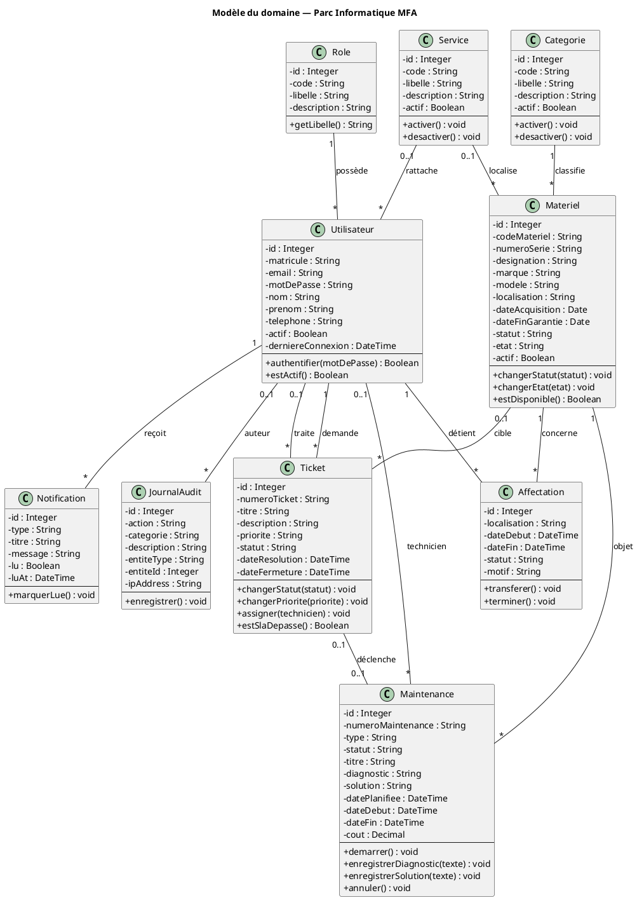

---

## 5.8 Diagrammes de classes de conception par sprint

Convention UML : `-` attribut privé, `+` méthode publique.  
Chaque diagramme ne montre que les classes **livrées / enrichies** dans le sprint concerné (correspondance Product Backlog / Sprint Backlog §5.4).

### Sprint 1 — Authentification & profil (PB01, PB02)

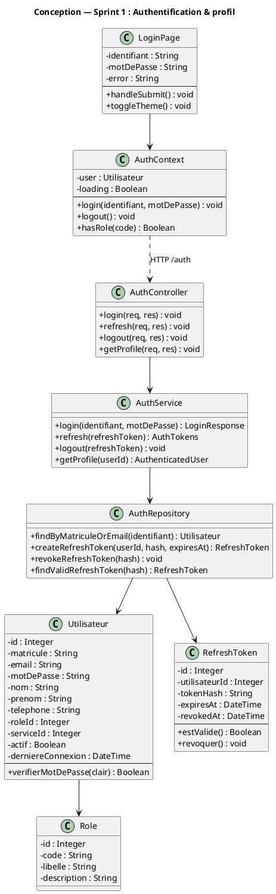

### Sprint 2 — Référentiels (PB03, PB04, PB05)

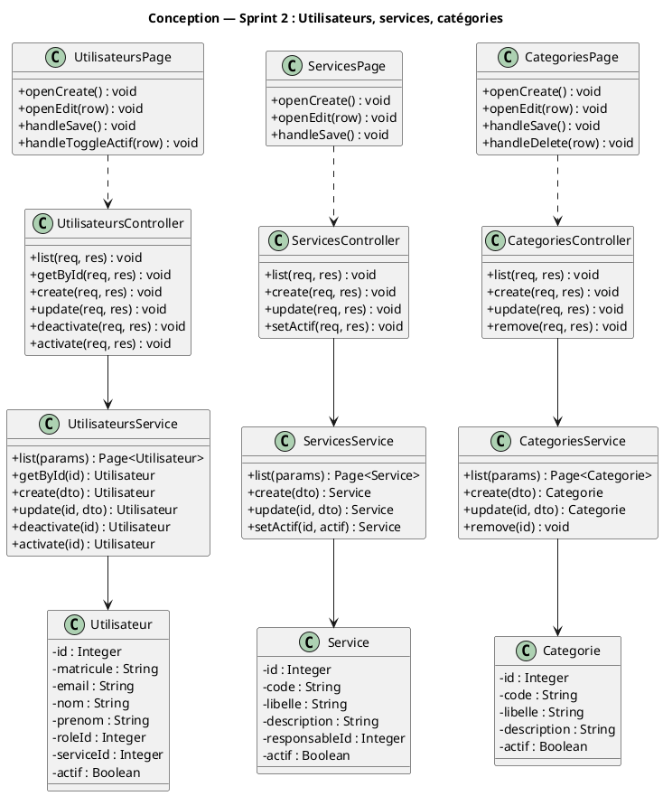

### Sprint 3 — Inventaire matériels (PB06, PB07)

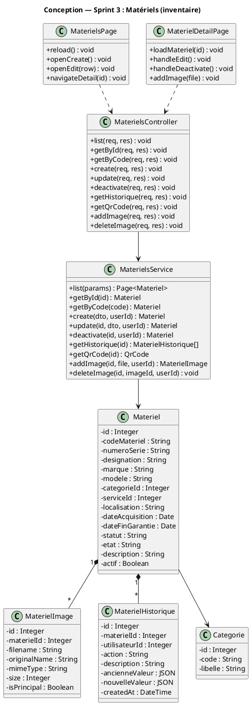

### Sprint 4 — Affectations (PB08)

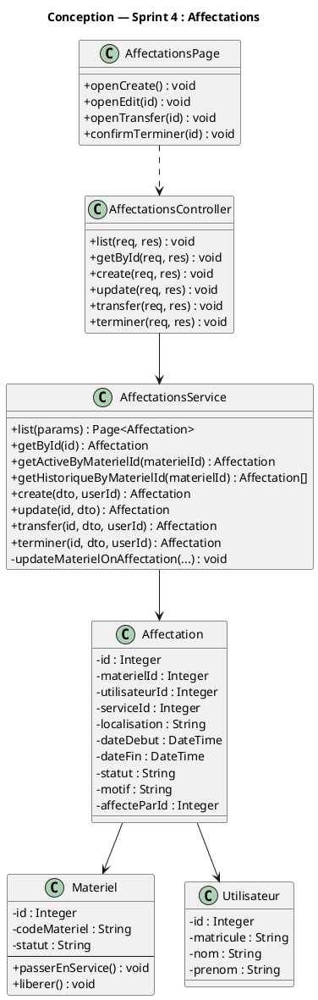

### Sprint 5 — Tickets (PB09, PB10, PB11)

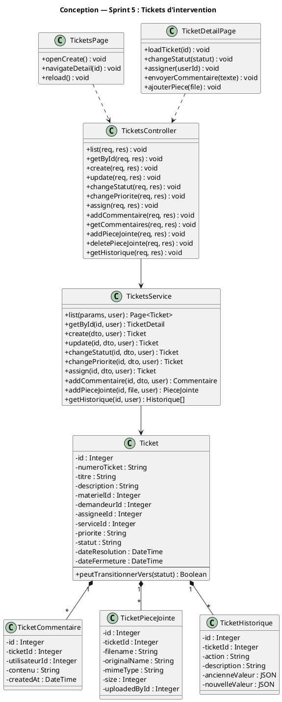

### Sprint 6 — Notifications (PB13)

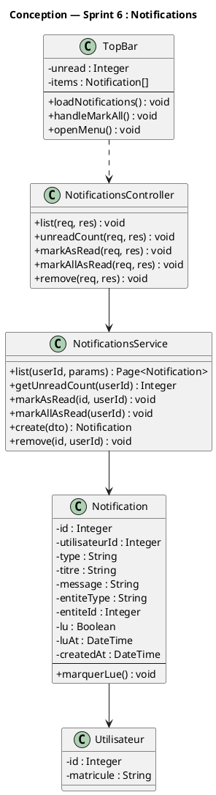

### Sprint 7 — Maintenances (PB12)

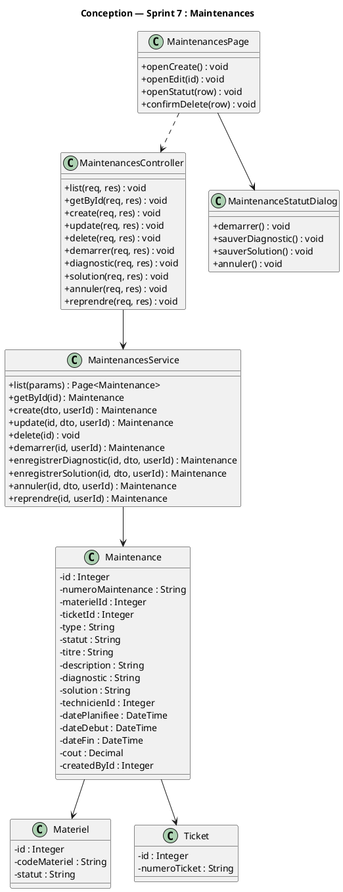

### Sprint 8 — Dashboard & SLA (PB14, PB15)

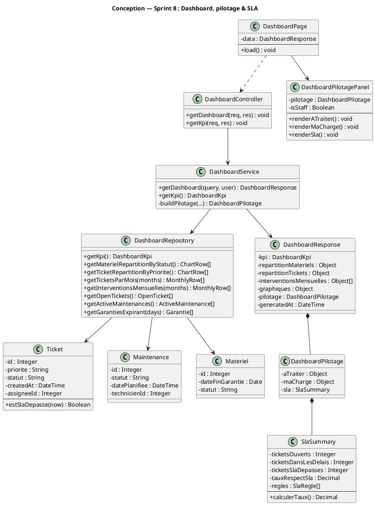

### Sprint 9 — Rapports & journal d’audit (PB16, PB17)

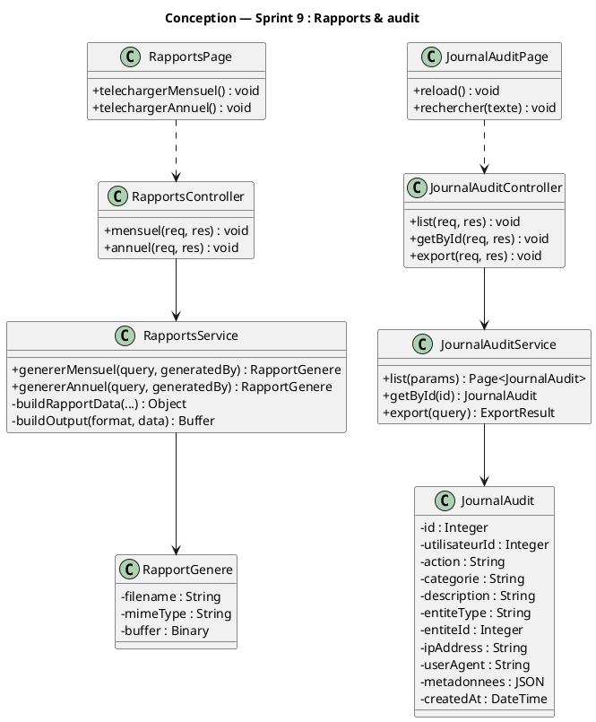

### Sprint 10 — Qualité, démo & polish (PB18, PB19, PB20)

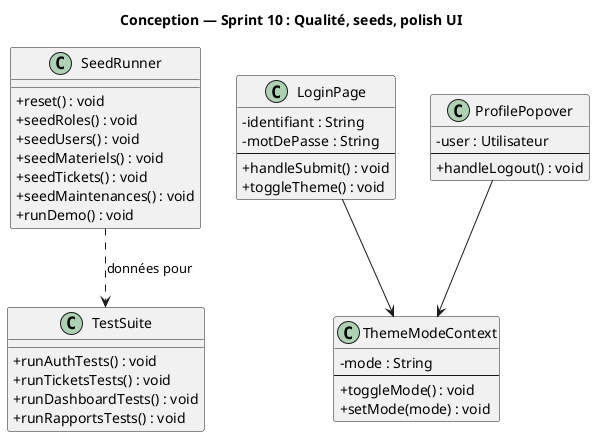

---

## 5.9 Diagramme de classes de conception globale

Vue d’ensemble des couches avec attributs / opérations **représentatives** (détail complet dans chaque sprint §5.8).

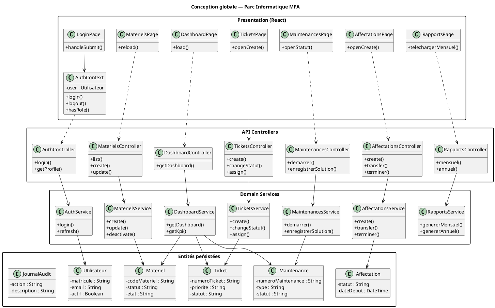

---

## 5.10 Diagramme de paquetage

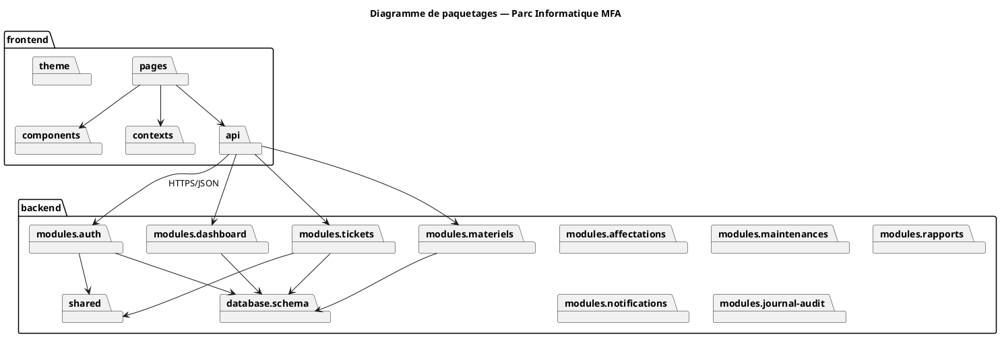

---

## 5.11 Diagramme de déploiement

*(Numérotation demandée « 5.10 déploiement » après paquetage — ici 5.11 pour éviter le doublon avec 5.10 paquetage.)*

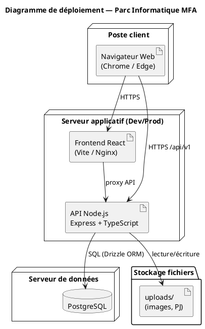

---

## Synthèse

L’analyse conceptuelle Scrum cadre le stage autour d’un **Product Backlog** priorisé, de **4 releases** et **10 sprints**, d’un **dictionnaire de données**, de **règles de gestion** et de **diagrammes UML** (domaine, classes, paquetages, déploiement).  
Le chronogramme PlantUML du stage (analyse de l’existant → sprints → tests → mémoire en parallèle) est fourni dans le document distinct : [`CHRONOGRAMME_STAGE.puml`](./CHRONOGRAMME_STAGE.puml).

---

*Chapitre 5 — Analyse conceptuelle — Parc Informatique MFA — Stage 2026*
